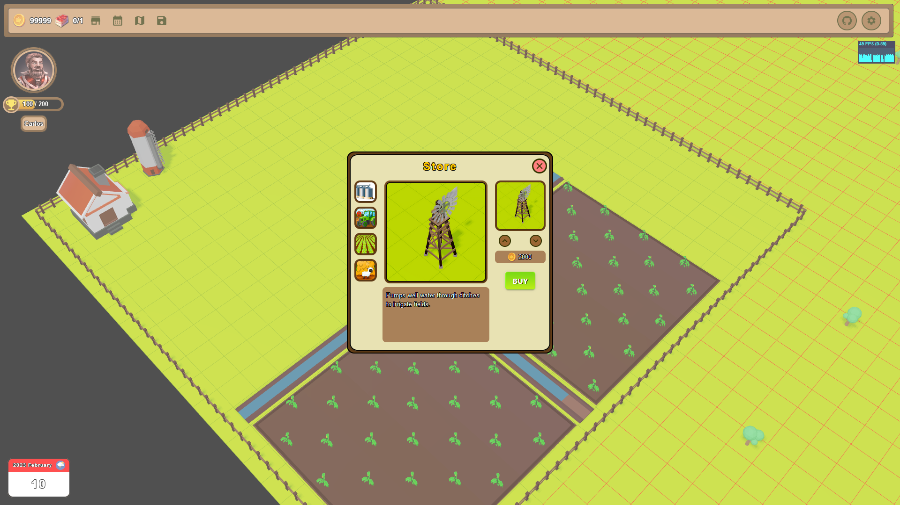

<H1 align="center">
    <strong>three-farm-deploy</strong>
</H1>

This repository is to show the deploy of a demo that I am doing. Using three js and react.
The demo is a basic remake of the classic sim farm.
Suggestions, ideas and everything else is appreciated.

<H2 align="center">
    <strong>Tasks:</strong>
</H2>

- [x] Generate map.
- [x] Add select box.
- [x] Add avatar and name change system
- [x] Add store, add items, buy items and position them on the map.
- [x] Add state bar to items on the map
- [x] Add Fence and Ditch, which change the model if there are others of the same item nearby.
- [x] Add purchase and sale of land (only allows land to be sold without being empty).
- [x] Add sound controller.
- [x] Add example crop(corn).
- [x] Add harvest storage system, which grows according to available silos.
- [x] Add internal timer, for time and climate management.
- [ ] That the example crop becomes an item in the store according to the weather and climate timer.
- [ ] Add a window to see the items in the storage.
- [ ] Improve the example crop status bar to see if it has enough water, fertilizer, pesticide, and fungicide.

- Soon more tasks for this demo.

<H2 align="center">
    <strong>Screenshots:</strong>
</H2>

     

     

     

     

     

     

